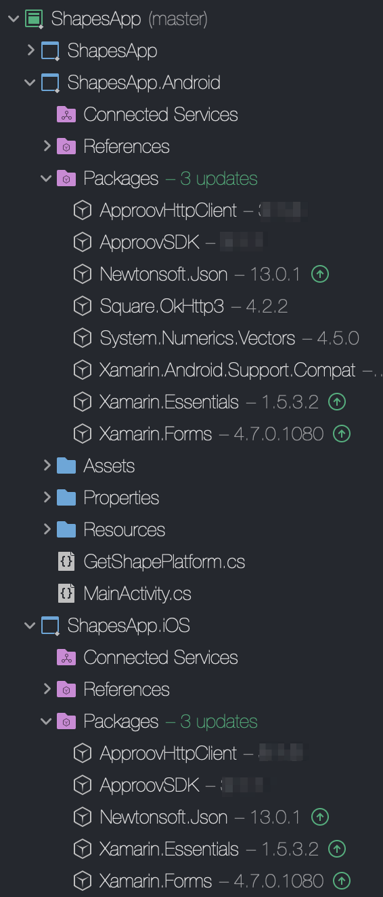

# Approov Quickstart: Xamarin HttpClient

This quickstart is written specifically for mobile iOS and Android apps that are written in C# for making the API calls that you wish to protect with Approov. The sample code shown in this guide makes use of HttpClient in order to access network resources. If this is not your situation then check if there is a more relevant quickstart guide available.

This quickstart provides the basic steps for integrating Approov into your app. A more detailed step-by-step guide using a [Shapes App Example](https://github.com/approov/quickstart-xamarin-httpclient/blob/master/SHAPES-EXAMPLE.md) is also available.

To follow this guide you should have received an onboarding email for a trial or paid Approov account.

## ADDING THE APPROOV SDK ENABLED HTTP CLIENT

The ApproovSDK makes use of a custom `HttpClient` implementation, `ApproovHttpClient` and it is available as a NuGet package in the default repository `nuget.org`. Since the `ApproovHttpClient` uses platform specific code you will need to add the NuGet packages to the `ShapesApp.Android` and `ShapesApp.iOS` projects instead of the generic `ShapesApp` project. Select `Project` and `Manage NuGet Packages...` then select `Browse` and search for the `ApproovHttpClient` package.

You will also need to install the corresponding iOS/Android implementations `ApproovHttpClient-Platform-Specific`.

Select and install both packages.

## ADDING THE APPROOV SDK

The ApproovSDK is available as a NuGet package and at the time of writing this quickstart, the packages name and version is `ApproovSDK`(2.4.0).

Your project structure should now look like this:

## CHECKING IT WORKS
Initially you won't have set which API domains to protect, so the interceptor will not add anything. It will have called Approov though and made contact with the Approov cloud service. You will see logging from Approov saying `UNKNOWN_URL`.

Your Approov onboarding email should contain a link allowing you to access [Live Metrics Graphs](https://approov.io/docs/latest/approov-usage-documentation/#metrics-graphs). After you've run your app with Approov integration you should be able to see the results in the live metrics within a minute or so. At this stage you could even release your app to get details of your app population and the attributes of the devices they are running upon.

However, to actually protect your APIs there are some further steps you can learn about in [Next Steps](https://github.com/approov/quickstart-xamarin-httpclient/blob/master/NEXT-STEPS.md).